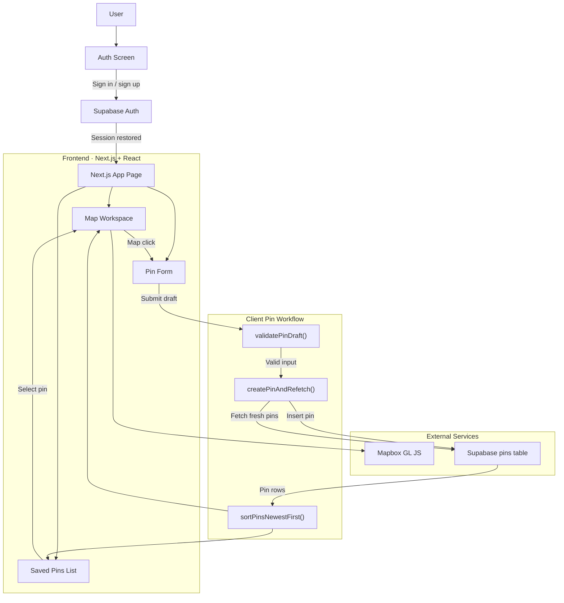

# Chapman BlockPins

**A personal campus pinboard for Chapman University.**

Chapman BlockPins is a map-first web app where users sign in, drop pins around Chapman University, add short notes, and persist those locations to their own account. The app is built to demonstrate a clean full-stack flow: authentication, interactive map input, client-side validation, database persistence, and synchronized UI state between the map and the saved pin list.

## Live App

[blockpins.vercel.app](https://blockpins.vercel.app/)

## App Flow

1. **Sign in** - Users authenticate with Supabase email/password auth.
2. **Load session** - The app restores the current session and fetches the user's saved pins.
3. **Explore the map** - A Mapbox map opens centered on Chapman University.
4. **Drop a pin** - Clicking the map stages coordinates for a new pin.
5. **Add context** - The user enters a title and optional note.
6. **Validate input** - The client enforces title and note length rules before saving.
7. **Persist to Supabase** - The pin is inserted into the `pins` table for the current user.
8. **Refetch and sync UI** - The app reloads the user's pins, sorts newest first, and updates the list and selected map marker.
9. **Review saved locations** - Selecting a list item or marker reveals the saved note and coordinates.

## Architecture

| Layer | Stack | Role |
| --- | --- | --- |
| **Frontend** | Next.js 16 · React 19 · TypeScript · Framer Motion | Renders the auth screen, map workspace, pin form, saved pin list, and animated panel transitions |
| **Map UI** | Mapbox GL JS | Displays the Chapman-centered map, captures clicks, renders pin markers, and shows pin popups |
| **Auth + Data** | Supabase Auth · Supabase Postgres | Handles email/password sessions and persists each user's pins |
| **Client Domain Logic** | `lib/pins/*` | Validates draft input, saves pins, refetches fresh state, and keeps the list ordered newest first |
| **Deployment** | Vercel | Hosts the production Next.js app |

## System Diagram



## How The App Works

### 1. Authentication Gate

The app boots in `app/page.tsx` and creates a browser Supabase client. On load, it checks for an existing auth session and subscribes to auth state changes. Unauthenticated users stay on the email/password screen; authenticated users move into the map workspace.

### 2. Map Interaction

`components/pins-map.tsx` initializes Mapbox GL JS with the Chapman campus center and default zoom. When the user clicks the map, the app stores the clicked latitude and longitude as a staged draft pin and opens the pin form.

### 3. Pin Creation Workflow

Before saving, the app validates the draft with `validatePinDraft()`:

- `title` is required
- `title` must be 80 characters or fewer
- `note` must be 280 characters or fewer

If validation passes, the app runs `createPinAndRefetch()`, which inserts the new pin and immediately fetches the latest saved pins for that user.

### 4. State Synchronization

After refetching, the pins are ordered with `sortPinsNewestFirst()`. That sorted data drives:

- the saved pins list in the side panel
- the rendered Mapbox markers
- the selected pin detail card
- the popup/fly-to behavior on the map

This keeps the map view and the list view in sync after every save or selection.

## Key Files

| File | Responsibility |
| --- | --- |
| `app/page.tsx` | Main app flow: auth, session bootstrap, map layout, draft state, save flow, and pin selection |
| `components/pins-map.tsx` | Mapbox initialization, marker rendering, popups, and map click handling |
| `lib/pins/repository.ts` | Supabase reads and writes for the `pins` table |
| `lib/pins/workflow.ts` | Save-then-refetch workflow abstraction |
| `lib/pins/validation.ts` | Pin title/note validation rules |
| `lib/pins/sort.ts` | Newest-first pin ordering |
| `lib/supabase/client.ts` | Browser Supabase client bootstrap and session persistence config |

## Quickstart

```bash
npm install
cp .env.example .env.local
npm run dev
```

Set these environment variables in `.env.local`:

- `NEXT_PUBLIC_SUPABASE_URL`
- `NEXT_PUBLIC_SUPABASE_ANON_KEY`
- `NEXT_PUBLIC_MAPBOX_ACCESS_TOKEN`

Run the schema in your Supabase project:

- [supabase/schema.sql](./supabase/schema.sql)

## Scripts

```bash
npm run dev
npm run lint
npm run test
npm run build
```

## Testing

Current automated tests cover:

- Chapman map defaults
- pin validation rules
- newest-first sorting
- save-then-refetch workflow behavior

RLS ownership behavior should still be verified in Supabase with multiple users.

## Deployment

The app is deployed on Vercel:

- Production: [blockpins.vercel.app](https://blockpins.vercel.app/)

To redeploy manually:

1. Push the repository to GitHub.
2. Import the project into Vercel.
3. Add the required environment variables.
4. Deploy.

## Summary

Chapman BlockPins is a compact full-stack demo that shows how a modern Next.js app can combine Supabase auth, persistent per-user data, and a live Mapbox interface into a single coherent workflow. The project is intentionally small, but the README is designed to make the architecture and data flow easy to understand at a glance.
